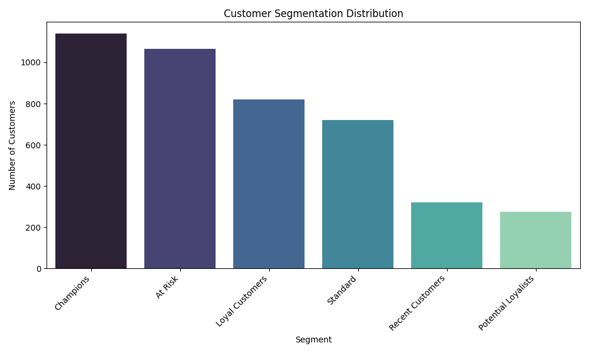

# AI-Powered Business Analyst for E-Commerce Data

## 📈 Overview

This project is a comprehensive, full-cycle data science analysis of a large e-commerce dataset containing over 500,000 transaction records. The goal is to move beyond simple data reporting and act as an AI-powered business analyst to uncover actionable insights, segment customers, and build a predictive model to identify high-value customer potential.

The project culminates in using Google's Gemini AI to automatically generate a high-level executive summary of the complex findings, demonstrating a powerful hybrid approach that blends traditional machine learning with modern generative AI.

---

## 💡 Key Skills & Analysis Performed

This project showcases a complete data science workflow from start to finish:

1.  **Data Cleaning & Preparation:** Processed a large, raw dataset by handling over 140,000 rows with missing data and invalid entries (e.g., negative quantities).
2.  **Exploratory Data Analysis (EDA):** Identified key business metrics, such as the top 10 revenue-generating countries.
3.  **RFM Analysis:** Performed a classic marketing segmentation by calculating **Recency, Frequency, and Monetary** value for each of the 4,300+ unique customers.
4.  **Customer Segmentation:** Used RFM scores to group customers into strategic segments like "Champions" and "Loyal Customers," providing a clear view of the customer base.
5.  **Predictive Modeling (`scikit-learn`):** Trained a logistic regression model to predict whether a new customer is likely to become a "Champion" based on their RFM characteristics, achieving **over 97% accuracy**.
6.  **Generative AI Reporting (`Google Gemini`):** Automatically translated the quantitative results into a qualitative, business-ready executive summary.

---

## 📊 Final Results

The analysis successfully segmented the customer base and produced a highly accurate predictive model.

### Sample AI-Generated Executive Summary:
> "Our analysis reveals that the **United Kingdom is the dominant market**, accounting for the vast majority of total sales. The most significant customer segment is our **'Champions,'** who, despite being a smaller group, represent our most valuable and engaged customers. The predictive model we've developed can identify potential 'Champions' with **over 97% accuracy**, enabling targeted marketing strategies to nurture high-value relationships and drive future growth."

---

## 🛠️ Technologies Used

* **Python:** The core programming language.
* **Pandas & NumPy:** For data manipulation, cleaning, and analysis.
* **Matplotlib & Seaborn:** For data visualization.
* **Scikit-learn:** For building and evaluating the predictive machine learning model.
* **Google Gemini Pro API:** For the final AI-powered report generation.

---

## ▶️ How to Run Locally

1.  **Clone the repository.**
2.  **Place the `data.csv`** file from Kaggle in the main directory.
3.  **Create and activate a virtual environment:** `py -m venv venv` and `source venv/Scripts/activate`.
4.  **Install dependencies:** `pip install -r requirements.txt`.
5.  **Set your API key** as an environment variable (`export GEMINI_API_KEY='...'`).
6.  **Run the script:** `py analyzer.py`.
